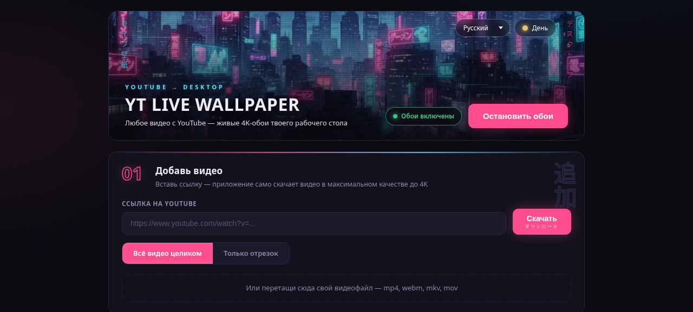
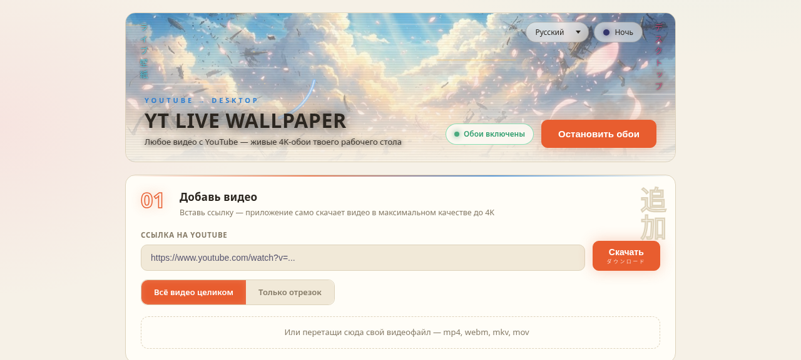

<div align="center">

# YT Live Wallpaper

**Любое видео с YouTube — живые 4K-обои твоего рабочего стола Windows.**

Вставил ссылку → приложение само скачало → видео крутится за иконками вместо статичной картинки.


<br />



<sub>Неоновая ночь и тёплый день — темы переключаются одной кнопкой. Интерфейс на 10 языках.</sub>



</div>

---

**English TL;DR:** Turn any YouTube video into a live 4K wallpaper on Windows.
Paste a link — the app downloads it (whole or a timestamped section) and plays it
behind your desktop icons via the WorkerW trick. Playlists, crossfade, multi-monitor,
auto-pause in games and on battery, 10 UI languages. One-click installer in
[Releases](../../releases/latest); binaries (yt-dlp/ffmpeg) are fetched automatically
on first run.

---

## Установка за пару кликов

1. Скачайте `YT-Live-Wallpaper-Setup-x.x.x.exe` из [последнего релиза](../../releases/latest)
2. Запустите — установщик в один клик, приложение откроется само
3. При первом запуске приложение само докачает компоненты для работы с видео
   (yt-dlp и ffmpeg, ~100 МБ) — с прогрессом на экране, один раз

Всё. Вставьте ссылку на YouTube — через минуту у вас живые обои.

> Windows SmartScreen может предупредить о неизвестном издателе (приложение не подписано
> сертификатом — он стоит денег). Нажмите «Подробнее» → «Выполнить в любом случае».

## Возможности

- **YouTube до 4K** — целиком или отрезком по таймкодам (`1:20` – `1:50`)
- **Свои файлы** — перетащите mp4/webm/mkv/mov прямо в окно
- **Три режима цикла** — один клип по кругу / друг за другом / смена по таймеру
- **Плавный кроссфейд** между клипами, без чёрного моргания
- **Несколько мониторов** — обои на основном, выбранном или на всех
- **Умная экономия GPU** — пауза при играх, полноэкранных приложениях, развёрнутых окнах, на батарее и при блокировке экрана
- **Звук** с регулятором и mute (по желанию)
- **Трей** — запуск/стоп, следующий клип, звук без открытия панели
- **Две темы панели** — неоновая ночь и тёплый день, с анимацией боя в шапке
- **Автозапуск** с Windows

## Запуск из исходников

Без терминала: дважды кликните **`run-dev.bat`** — при первом запуске он сам
поставит зависимости и откроет приложение. Нужен только [Node.js](https://nodejs.org).

Или из терминала (Node.js 20+, pnpm или npm):

```bash
pnpm install    # зависимости
pnpm start      # запуск — yt-dlp и ffmpeg докачаются сами при первом старте
```

Опционально: `pnpm setup` заранее положит yt-dlp и ffmpeg в `bin/` проекта.

## Сборка установщика

Без терминала: дважды кликните **`build-installer.bat`** — он сам поставит зависимости,
скачает yt-dlp/ffmpeg, соберёт установщик и откроет папку `dist/` с готовым
`YT-Live-Wallpaper-Setup-x.x.x.exe`. Нужен только установленный [Node.js](https://nodejs.org).

Или из терминала:

```bash
pnpm dist       # готовый .exe появится в dist/
```

Установщик самодостаточен — на целевом ПК не нужны ни Node.js, ни Python.
Если перед сборкой выполнить `pnpm setup`, бинарники запакуются внутрь установщика
и первый запуск у пользователей будет мгновенным; без этого приложение докачает их само.

Релизы собираются автоматически: пуш тега `v*` запускает GitHub Actions
(`.github/workflows/release.yml`), который собирает установщик на Windows
и прикрепляет его к релизу.

## Как это работает

- **Скачивание** — [yt-dlp](https://github.com/yt-dlp/yt-dlp) с `--download-sections`
  вырезает нужный отрезок прямо при загрузке (точная вырезка через ffmpeg).
- **Обои** — трюк с окном `WorkerW`: приложение шлёт `Progman` сообщение `0x052C`,
  Windows создаёт слой позади иконок рабочего стола, и туда через `SetParent`
  (koffi → `user32.dll`) встраивается окно Electron с `<video>`.
  На каждый монитор — своё окно с пересчётом координат виртуального экрана.
- **Кроссфейд** — два слоя `<video>`: новый клип грузится в скрытый слой
  и плавно проявляется поверх старого.
- **Пауза при играх** — раз в 2 секунды проверяется, покрывает ли активное окно
  весь экран; батарея и блокировка экрана — через `powerMonitor`.

## Структура проекта

```
src/
  main/
    main.js               главный процесс: окна, IPC, мониторы
    playlist.js           логика плейлиста: режимы цикла, таймер, следующий клип
    tray.js               иконка и меню в трее
    wallpaper.js          WorkerW-трюк (koffi + user32.dll)
    downloader.js         yt-dlp: очередь загрузок, миниатюры, ошибки
    bin-manager.js        поиск и автодокачка yt-dlp/ffmpeg, обновление
    fullscreen-monitor.js детект полноэкранных/развёрнутых приложений
    store.js              JSON-хранилище настроек и клипов
  preload.js              мост для панели управления
  preload-wallpaper.js    минимальный мост для окна-обоев
  renderer/               панель управления (UI, темы, i18n на 10 языков)
  wallpaper-window/       окно-обои с кроссфейдом
tests/                    unit-тесты (node --test)
scripts/setup-bins.mjs    предзагрузка yt-dlp и ffmpeg (опционально)
.github/workflows/        CI (линт + тесты) и автосборка релизов
```

## Разработка

```bash
pnpm test     # unit-тесты (node:test, без зависимостей)
pnpm lint     # ESLint
pnpm format   # Prettier
```

## FAQ

**Видео перестали скачиваться.**
YouTube периодически меняет сайт. Нажмите «Обновить yt-dlp» в настройках — обычно чинит.

**Обои тормозят в играх.**
Включите «Паузу при играх» в настройках (включена по умолчанию) — видео
останавливается, когда что-то открыто на весь экран.

**Куда скачиваются видео?**
`%APPDATA%/yt-live-wallpaper/videos`. Локальные файлы не копируются — плейлист
ссылается на оригинал, и при удалении клипа ваш файл остаётся на месте.

**Работает на macOS/Linux?**
Нет. Механизм WorkerW существует только в Windows. Панель откроется, но обои не встанут.

## Вклад

PR и issue приветствуются — см. [CONTRIBUTING.md](CONTRIBUTING.md).

## Лицензия

[MIT](LICENSE). Скачивая видео с YouTube, вы соглашаетесь с условиями YouTube ToS —
используйте загрузку только для личных целей.
