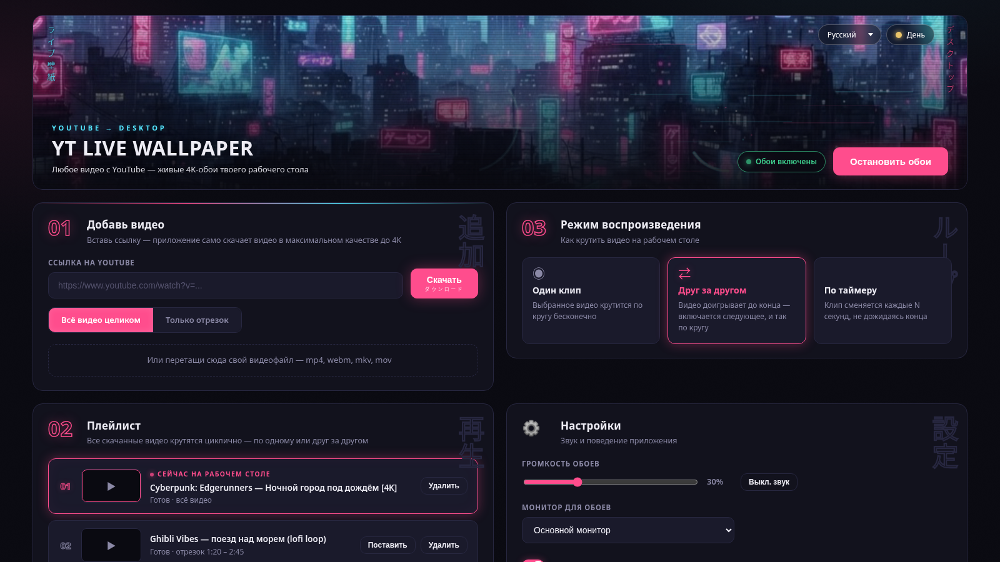
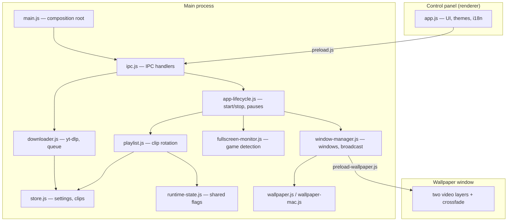

<div align="center">

# YT Live Wallpaper

**Turn any YouTube video into a live 4K wallpaper for your desktop.**

Paste a link → the app downloads it → the video plays behind your desktop icons instead of a static image.

**English** | [Русский](docs/README.ru.md)

[](https://github.com/HumSaw/yt-live-wallpaper/actions/workflows/ci.yml)
[](https://github.com/HumSaw/yt-live-wallpaper/releases/latest)
[](https://github.com/HumSaw/yt-live-wallpaper/releases)


<br />



<sub>Neon night and warm day themes, switchable with one click. UI in 10 languages.</sub>

</div>

---

## Install in two clicks

1. Download the package for your OS from the [latest release](https://github.com/HumSaw/yt-live-wallpaper/releases/latest):
   - **Windows** — `YT-Live-Wallpaper-Setup-x.x.x.exe`
   - **macOS** — `YT-Live-Wallpaper-x.x.x-mac.dmg`
   - **Linux** — `YT-Live-Wallpaper-x.x.x-linux.AppImage`
2. Run it — the app opens by itself
3. On first launch the app fetches the video tooling it needs, once, with
   on-screen progress. On macOS/Linux you also need ffmpeg from your package
   manager (`brew install ffmpeg` / `sudo apt install ffmpeg`) — the app will
   tell you if it's missing

That's it. Paste a YouTube link — you'll have a live wallpaper in a minute.

> Windows SmartScreen may warn about an unknown publisher (the app isn't
> code-signed — certificates cost money). Click "More info" → "Run anyway".

## Features

- **YouTube up to 4K** — the whole video or a section by timestamps (`1:20` – `1:50`)
- **Local files** — drag mp4/webm/mkv/mov right into the window
- **Three loop modes** — single clip on repeat / one after another / switch on a timer
- **Smooth crossfade** between clips, no black flicker
- **Multi-monitor** — wallpaper on the primary, a specific, or all displays
- **Smart GPU saving** — pauses during games, fullscreen apps, maximized windows, on battery, and when the screen is locked
- **Audio** with a volume slider and mute (optional)
- **Tray** — start/stop, next clip, and sound without opening the panel
- **Two panel themes** — neon night and warm day, with animated rain in the header
- **Autostart** with the system (Windows/macOS)

<div align="center">
 
</div>

## Run from source

No terminal (Windows): double-click **`run-dev.bat`** — on first run it installs
dependencies and opens the app. All you need is [Node.js](https://nodejs.org).

Or from a terminal (Node.js 20+, pnpm or npm):

```bash
pnpm install    # dependencies
pnpm start      # run — yt-dlp and ffmpeg are fetched automatically on first start
```

Optional: `pnpm setup` pre-downloads yt-dlp and ffmpeg into the project's `bin/`.

## Build the installer

No terminal (Windows): double-click **`build-installer.bat`** — it installs
dependencies, fetches yt-dlp/ffmpeg, builds the installer, and opens the `dist/`
folder with the ready `YT-Live-Wallpaper-Setup-x.x.x.exe`. All you need is
[Node.js](https://nodejs.org).

Or from a terminal:

```bash
pnpm dist         # Windows .exe
pnpm dist:mac     # macOS .dmg
pnpm dist:linux   # Linux .AppImage
```

The installer is self-contained — the target machine needs neither Node.js nor
Python. If you run `pnpm setup` before building, the binaries get packed inside
the installer and the first launch is instant; otherwise the app fetches them
itself.

Releases are built automatically: pushing a `v*` tag triggers GitHub Actions
(`.github/workflows/release.yml`), which builds the Windows (.exe), macOS (.dmg)
and Linux (.AppImage) packages and attaches them to the release.

## How it works

- **Downloading** — [yt-dlp](https://github.com/yt-dlp/yt-dlp) with
  `--download-sections` cuts the requested segment during the download itself
  (precise cutting via ffmpeg).
- **Wallpaper (Windows)** — the `WorkerW` trick: the app sends `Progman` the
  `0x052C` message, Windows creates a layer behind the desktop icons, and the
  Electron window with `<video>` is embedded into it via `SetParent`
  (koffi → `user32.dll`). One window per monitor with virtual-screen
  coordinate mapping.
- **Wallpaper (macOS)** — the NSWindow level is lowered to
  `kCGDesktopWindowLevel` (koffi → objc-runtime) — below the icon layer,
  video behind the shortcuts.
- **Wallpaper (Linux)** — the window is created with the `desktop` type (X11)
  and lives at the desktop background level.
- **Crossfade** — two `<video>` layers: the next clip loads in a hidden layer
  and fades in over the old one.
- **Game pause** — every 2 seconds the app checks whether the active window
  covers the whole screen; battery and screen lock via `powerMonitor`.

## Architecture



Dependency rule: lower-level modules (store, playlist, runtime-state) know
nothing about windows or IPC. `main.js` is a thin entry point that passes
callbacks at init time; all logic lives in single-responsibility modules.

### Why Electron

The task is to render video codecs (VP9/AV1/H.264) with hardware acceleration,
an HTML crossfade layer, and identically across three OSes. Chromium does this
out of the box: `<video>` plus two layers with an opacity transition — no need
to build a native video player per platform. The cost is distribution size,
but for a desktop video app it's a fair trade.

### Why WorkerW (Windows)

Windows has no official API for "draw my window behind the desktop icons".
The only community-documented way is the undocumented `0x052C` message to
`Progman`: it makes Windows create a `WorkerW` window behind the icon layer
(originally for the wallpaper-change animation). Our window becomes its child
via `SetParent` and lands exactly between the wall and the icons. This is how
Wallpaper Engine and Lively Wallpaper work.

The nuance that breaks half of similar projects: in Windows 11 24H2 the icon
layer (`SHELLDLL_DefView`) moved inside `Progman` itself, and the old
algorithm puts the window ON TOP of the icons. So `wallpaper.js` detects the
layout first: if DefView is inside Progman, the window is inserted into the
z-order right BELOW it via `SetWindowPos`; otherwise the classic
WorkerW-sibling path is used. FFI calls (`user32.dll`) go through koffi — no
native compilation at install time.

On macOS the same is achieved through supported APIs: the NSWindow level is
lowered to `kCGDesktopWindowLevel` via objc-runtime. On Linux (X11) a window
of type `desktop` is enough — the WM keeps it at the background level.

## Project structure

```
src/
  main/
    main.js               entry point: wires modules, app events
    window-manager.js     windows (panel + wallpaper), renderer state
    ipc.js                IPC handlers, clip downloads, undo-removal
    app-lifecycle.js      wallpaper start/stop, pauses, first-run setup
    runtime-state.js      shared runtime flags (pauses, setup, quitting)
    playlist.js           playlist logic: loop modes, timer, next clip
    tray.js               tray icon and menu
    wallpaper.js          WorkerW trick for Windows (koffi + user32.dll)
    wallpaper-mac.js      macOS desktop window level (koffi + objc)
    downloader.js         yt-dlp: download queue, thumbnails, errors
    bin-manager.js        yt-dlp/ffmpeg discovery, auto-fetch, updates
    fullscreen-monitor.js fullscreen/maximized app detection
    store.js              JSON store for settings and clips
  preload.js              bridge for the control panel
  preload-wallpaper.js    minimal bridge for the wallpaper window
  renderer/               control panel (UI, themes, i18n for 10 languages)
  wallpaper-window/       wallpaper window with crossfade
tests/                    unit tests: downloader, store, playlist (node --test)
scripts/setup-bins.mjs    pre-download yt-dlp and ffmpeg (optional)
.github/workflows/        CI (lint + tests) and automated release builds
```

## Development

```bash
pnpm test     # unit tests (node:test, no dependencies)
pnpm lint     # ESLint
pnpm format   # Prettier
```

The panel UI can be previewed in a regular browser — open
`src/renderer/index.html`: `dev-mock.js` provides test data.

## Roadmap

- [ ] Scheduler: different wallpapers for morning and evening
- [ ] Hotkeys (next clip, pause, sound)
- [ ] Presets — a "shelf" of popular loops
- [ ] Wayland support
- [ ] Code-signed installer

Want something from the list sooner — vote in
[Discussions](https://github.com/HumSaw/yt-live-wallpaper/discussions)
or send a PR.

## FAQ

**Videos stopped downloading.**
YouTube changes its site periodically. Click "Update yt-dlp" in settings —
that usually fixes it.

**Wallpaper lags in games.**
Enable "Pause during games" in settings (on by default) — the video stops
whenever something is fullscreen.

**Where are videos stored?**
`%APPDATA%/yt-live-wallpaper/videos` (Windows),
`~/Library/Application Support/yt-live-wallpaper/videos` (macOS),
`~/.config/yt-live-wallpaper/videos` (Linux). Local files are not copied —
the playlist references the original, and removing a clip keeps your file
in place.

**Does it work on macOS/Linux?**
Yes. On macOS the wallpaper window is lowered to the desktop background level
(below the icons) via objc-runtime; on Linux a `desktop`-type window is used
(X11 — full support; on Wayland behavior depends on the compositor).

## Contributing

PRs and issues are welcome — see [CONTRIBUTING.md](CONTRIBUTING.md).

## License

[MIT](LICENSE). By downloading videos from YouTube you agree to the YouTube
ToS — use downloads for personal purposes only.
